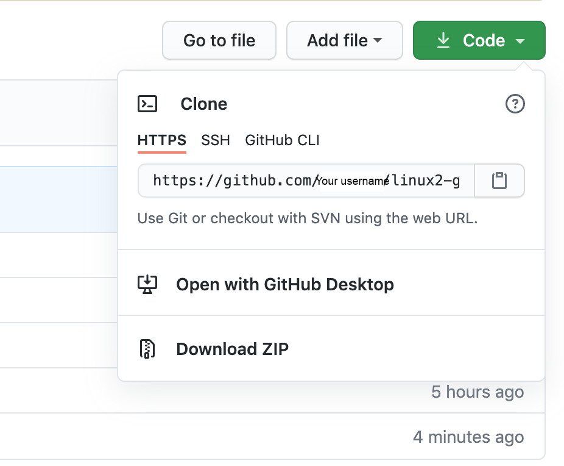

# Lab - Git

## Description

This is an individual lab in a group. You do the labs on your local machine and help each other.

## Prerequisites

Account in Github

## Objectives

- Make a pull request on a repository in Github

## Software

git

## TODO

#### Create a Github account

https://www.wikihow.com/Create-an-Account-on-GitHub

#### Fork this repository `https://github.com/maiyuki/linux2-git`

- Find the fork button in the upper right corner. it will be added to your repository


#### In your forked repository, create a new branch, add a file in directory `ADD-YOUR-FILE-HERE/`, push and merge to master branch

- Clone the repository from your repository `<your-github-account>/linux2-git` to your local machine



- Create a new branch

- Create a new file in `ADD-YOUR-FILE-HERE/`

- Make a commit and make a push to your repository

- Visit your repository on Github, click on `Compare & pull request` to make a pull request to your master branch


- Merge the branch to your master branch

#### Make a pull request to `maiyuki/linux2-git` repository

- Make a pull request in `<your-github-account>/linux2-git` which will do a pull request to `maiyuki/linux2-git` repository


- Wait for approval...

### Basic git commands (hints)

```bash
git init
git status
git commit
git checkout
git add
git diff
git branch
git merge
git push
git reset
git help
```

---

### Answers

See `../basic-commands/README`
